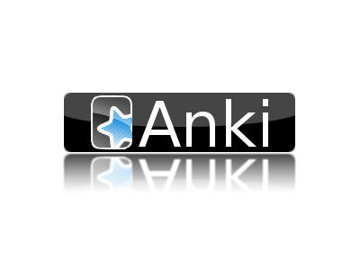

    <h1 align="center">Automatic, High Fidelity <b><i>Cebuano Flashcard</i></b> Generation</h1>

    

This is a project of <3 love... part of my effort to learn Cebuano to speak to Dr. Bautista's family, friends and community and to understand and integrate with her culture.

## Project Goal: Anki Templates and Python Automation

The goal of this project is to create an Anki template and associated Python scripts to generate new flash cards to be viewed in the [AnkiMobile Flashcards iOS App](https://apps.apple.com/us/app/ankimobile-flashcards/id373493387) on my iPhone 13 Pro. In practice the scripts should work for anyone learning Cebuano with their own word lists!

## What is Anki?

[Anki](https://apps.ankiweb.net/) is a system for _powerful, intelligent flash cards_. I use them to accelerate my language learning because no matter how much grammer you know... without drilling words until you have contextual access to them, you do not know diddly doo :)

This is a Python project to automate the creation of flashcards using the `genanki` PyPi module. In the past I have created flashcards as part of my own [rjurney/greek_anki](https://github.com/rjurney/greek_anki) project but I lost most of the code and the only thing remaining is [forvo.py](https://github.com/rjurney/greek_anki/blob/master/forvo.py) which did a pretty good job of downloading the audio file of the first pronunciation it found for an Ancient Greek word. I hope to make this work for Cebuano if practical.
